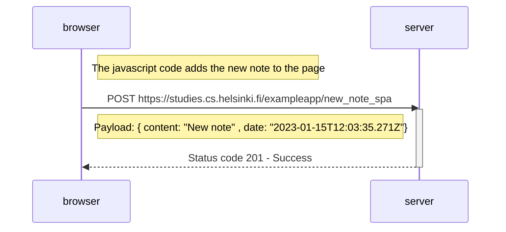

```mermaid
sequenceDiagram
participant browser
participant server

    note right of browser: The javascript code adds the new note to the page
    browser->>server: POST https://studies.cs.helsinki.fi/exampleapp/new_note_spa
    activate server

    note left of server: Payload: { content: "New note" , date: "2023-01-15T12:03:35.271Z"}

    server-->>browser: Status code 201 - Success
    deactivate server


```
